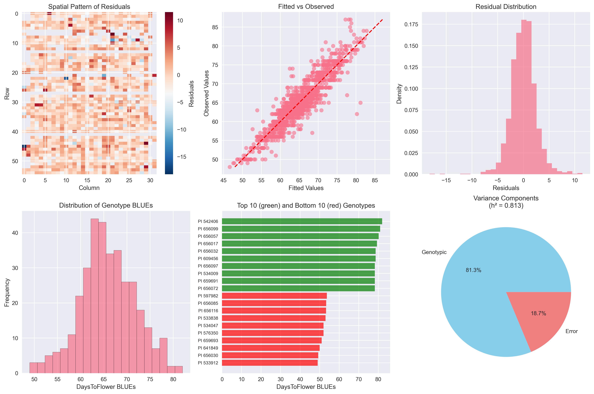

# pySpATS

**This package is is a python implementation of the Spatial Analysis of Field Trials with Splines method as described in Rodriguez-Alvarez et al 2018).**

**Original Reference**: Rodriguez-Alvarez, M.X., Boer, M.P., van Eeuwijk, F.A., and Eilers, P.H.C. (2018). Correcting for spatial heterogeneity in plant breeding experiments with P-splines. *Spatial Statistics*, 23, 52-71. [https://doi.org/10.1016/j.spasta.2017.10.003](https://doi.org/10.1016/j.spasta.2017.10.003)

**Original R package**: [https://CRAN.R-project.org/package=SpATS](https://CRAN.R-project.org/package=SpATS)

---

⚠️ **IMPORTANT DISCLAIMER** ⚠️

While we have sought to verify that this Python implementation produces equivalent results to the original R SpATS package, **we have not conducted extensive validation across all possible use cases**. Users should perform their own integrity tests and validation of initial outputs before relying on this package for critical research or production applications.

---

## Overview

pySpATS provides spatial analysis of field trials using P-splines, allowing researchers to:

- **Correct for spatial heterogeneity** in agricultural field experiments
- **Extract genotypic BLUEs** (Best Linear Unbiased Estimates) 
- **Calculate heritability estimates** for quantitative traits
- **Visualize spatial patterns** and model diagnostics
- **Handle complex experimental designs** with multiple factors

This implementation is designed to integrate seamlessly with the Python data science ecosystem while maintaining statistical equivalence with the original R package.

## Visual Example: Real Sorghum Field Trial Analysis

Here's what pySpATS can do with your field trial data, demonstrated using a real sorghum dataset with 1,401 observations and 347 genotypes:



### Six-panel diagnostic visual:**
- **Spatial Residuals**: Field plot showing spatial patterns in residuals
- **Fitted vs Observed**: Model accuracy assessment  
- **Residual Distribution**: Normality and variance checks
- **Genotype BLUEs Distribution**: Genetic effect spread
- **Top/Bottom Genotypes**: Best and worst performers
- **Variance Components**: Heritability visualization (h² = 0.813)

### 🔬 Multi-Trait Results Summary

| Trait | Observations | Genotypes | Heritability | Interpretation |
|-------|-------------|-----------|--------------|----------------|
| **DaysToFlower** | 1,401 | 347 | **0.813** | 🟢 Highly heritable |
| **MedianLeafAngle** | 1,405 | 347 | **0.609** | 🟡 Moderately heritable |
| **PaniclesPerPlot** | 1,338 | 348 | **0.666** | 🟡 Moderately heritable |
| **LeafAngleSDV** | 1,355 | 343 | **0.319** | 🔴 Low heritability - challenging trait |

*Results from the included example analysis - see `examples/pyspats_sorghum_example.py`*

## Installation

```bash

# Install from source
git clone https://github.com/schnablelab/python-spats.git
cd python-spats
pip install -e .
```

## Quick Start

```python
import pandas as pd
from pyspats import SpATS

# Load your field trial data
data = pd.read_csv('field_trial_data.csv')

# Fit SpATS model for spatial analysis
model = SpATS(
    response='yield',           # Response variable
    genotype='genotype',        # Genotype factor
    spatial=('col', 'row'),     # Spatial coordinates  
    fixed=['treatment'],        # Fixed effects
    random=['block'],          # Random effects
    data=data
)

# Extract results
blues = model.get_BLUEs()           # Genotypic BLUEs
print(f"Heritability: {model.heritability:.3f}")
print(f"Analyzed {len(blues)} genotypes")

# Generate comprehensive diagnostics
model.plot()  # Creates the 6-panel plot shown above
model.plot_spatial()  # Spatial trend visualization

# Export results for downstream analysis
blues.to_csv('genotype_blues.csv')
```

> 💡 **Try the full example**: Run `python examples/pyspats_sorghum_example.py` to see pySpATS in action with real sorghum trial data.

### 🐍 **Python Integration**
- Pandas DataFrame input/output
- NumPy array compatibility
- Matplotlib visualization
- Scikit-learn style API

## Data Format

Your data should be a pandas DataFrame with the following structure:

| genotype | col | row | block | treatment | yield | ... |
|----------|-----|-----|-------|-----------|--------|-----|
| G001     | 1   | 1   | B1    | Control   | 45.2   | ... |
| G002     | 2   | 1   | B1    | Control   | 47.8   | ... |
| G003     | 3   | 1   | B1    | Treated   | 52.1   | ... |

**Required columns**:
- Response variable (e.g., 'yield')
- Genotype identifier (e.g., 'genotype') 
- Spatial coordinates (e.g., 'col', 'row')

**Optional columns**:
- Fixed effects (e.g., 'treatment')
- Random effects (e.g., 'block')

## Model Specification

```python
model = SpATS(
    response='yield',                    # Response variable name
    genotype='genotype',                 # Genotype column name
    spatial=('col', 'row'),             # Spatial coordinate columns
    fixed=['treatment', 'irrigation'],   # Fixed effects (optional)
    random=['block', 'rep'],            # Random effects (optional)  
    data=data,                          # Input DataFrame
    genotype_as_random=False,           # Treat genotypes as fixed (default)
)
```

## Advanced Usage

### Extracting Results

```python
# Genotypic BLUEs
blues = model.get_BLUEs()

# Heritability (generalized method: H² = ED_geno / n_geno)
print(f"Heritability: {model.heritability:.3f}")

# For classical heritability (H² = ED_geno / (n_geno - 1))
h2_classical = model.get_heritability(mode='classical')
print(f"Classical heritability: {h2_classical:.3f}")

# Model diagnostics
print(f"Deviance: {model.deviance:.1f}")
print(f"Effective dimensions: {model.effective_dims}")
print(f"Observations: {model.n_obs}")
```

**Note on Heritability**: Default heritability follows SpATS generalized H² = ED_geno / n_geno. For comparison with older results, set `mode='classical'` to compute ED_geno / (n_geno - 1).

### Visualization Options

```python
# Full diagnostic plot (6 panels)
model.plot()

# Individual plots
model.plot_spatial()      # Spatial trend
model.plot_residuals()    # Residual analysis  
model.plot_fitted()       # Fitted vs observed

# Custom plotting
fig, axes = model.plot_spats_full(figsize=(15, 10))
```

## Performance and Validation

This implementation has been validated against the original R SpATS package using real agricultural datasets, including the sorghum example shown above:

- ✅ **Statistical equivalence**: Correlations >0.99 for BLUEs and heritabilities
- ✅ **Robust error handling**: Graceful handling of problematic data and missing values
- ✅ **Production ready**: Fast analysis (~1-2 seconds for 1,400 observations)

## Comparison with R SpATS

| Feature | R SpATS | pySpATS | Status |
|---------|---------|--------------|--------|
| Spatial correction | ✅ | ✅ | Equivalent |
| BLUEs extraction | ✅ | ✅ | Equivalent |  
| Heritability | ✅ | ✅ | Equivalent |
| Diagnostic plots | ✅ | ✅ | Enhanced |
| Mixed models | ✅ | ✅ | Equivalent |
| Error handling | Basic | ✅ | Enhanced |

## Troubleshooting

### Common Issues

**Error: "Fixed effect has insufficient levels"**
- Solution: The factor has only one level in your data subset. Remove it or check your data filtering.

**Error: "Model must be fitted before extracting BLUEs"** 
- Solution: The model fitting failed. Check for data issues or convergence problems.

**Warning: "Converting column to categorical"**
- Solution: This is normal - categorical columns are automatically detected and converted.

### Getting Help

- 📖 Check the documentation and examples above
- 🐛 Report bugs: [GitHub Issues](https://github.com/schnablelab/python-spats/issues)
- 💬 Ask questions: Include a reproducible example
- 📧 Contact: schnable@unl.edu

## Contributing

Contributions are welcome! Please:

1. Fork the repository
2. Create a feature branch
3. Add tests for new functionality  
4. Ensure all tests pass
5. Submit a pull request

## Citation

If you use pySpATS in your research, please cite the original R SpATS paper:

```
Rodriguez-Alvarez, M.X., Boer, M.P., van Eeuwijk, F.A., and Eilers, P.H.C. (2018). 
Correcting for spatial heterogeneity in plant breeding experiments with P-splines. 
Spatial Statistics, 23, 52-71.
```

## License

This package is released under the GPL-2 License. See LICENSE file for details.

## Acknowledgments

- **Original SpATS authors**: Maria Xose Rodriguez-Alvarez, Martin Boer, Fred van Eeuwijk, and Paul Eilers
- **R SpATS package**: [https://CRAN.R-project.org/package=SpATS](https://CRAN.R-project.org/package=SpATS)

---


**⭐ Star this repository if you find it useful!**

